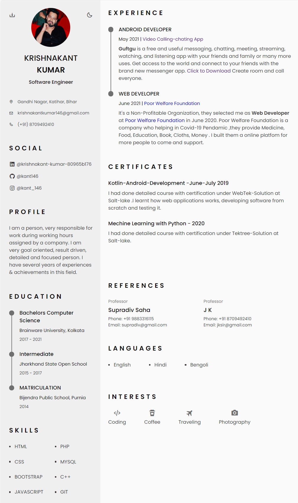

# Resume

### Hi there,  

&nbsp;

## I am krishnakant !! 

### Connect with me:

&nbsp;&nbsp;&nbsp;
 &nbsp; &nbsp; &nbsp; 

Live Project: https://kant146.github.io/Resume/

### My Resume thumbnail:

